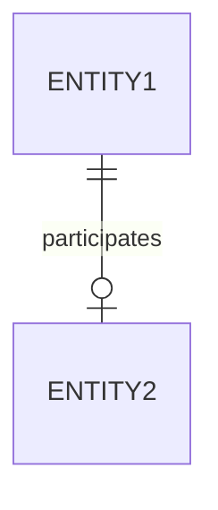

# One-to-one
A binary [[relationship]] where each [[entity]] might [[participation|participate]] at most once in it.

## Diagrammatic representation
Standard [[participation]] notation applies.

### [[diagram-standards|IDEF1X]]
These are connected by lines. 

### [[diagram-standards|Chen's notation]]
These are represented by a diamond that points a directed line (with an arrow head) to each participating entity.

## Reduction to the [[relational-model]]
Any side can be considered the "owning" side. Then, its primary key is added to the schema of the entity of the other side and set as a [[foreign-key]], if the [[participation]] is partial, then it's made nullable.
