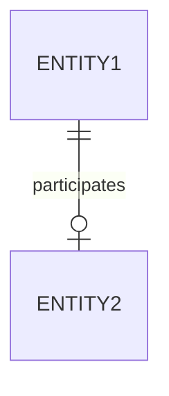

# Participation
A term that refers to the fact that an [[entity]] forms part of a [[relationship]] and how it does, there's two forms:

* **Partial**: If the entity might or might not participate in the relationship
* **Total**: If the entity must participate in the relationship

## Diagrammatic representation

### [[diagram-standards|IDEF1X]]
A hollow circle represents a partial relation, while a vertical bar represents a total relation.

### [[diagram-standards|Chen's notation]]
A normal line represents a partial relation, a double line represents a total one.
