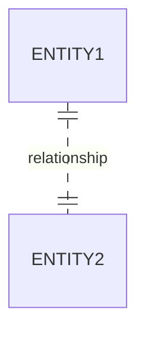

# Weak Entity
An [[entity]] whose identity depends on another entity. It doesn't have the necessary [[attribute]]s to uniquely identify itself, so it borrows them from an entity that does.

## Concepts
* The attributes of the weak entity are called **discriminator attributes**.
* **Identifying entity** it's the entity on which the weak entity depends.
* **Identifying [[relationship]]** is the relationship the weak entity has with its identifying entity. These are [[one-to-many|many-to-one]] and contain no descriptive attributes.

## Diagrammatic representation

### [[diagram-standards|IDEF1X]]
The weak entity is identified by a dotted line to its identifying entity

### [[diagram-standards|Chen's notation]]
The weak entity is identified by a double rectangle, and the diamond of the identifying relationship is also doubled.

## Reduction to the [[relational-model]]
Let $A$ be a weak entity set with attributes $a_1, a_2, \ldots, a_m$, let $B$ be the [[entity|strong entity]] on which it depends, whose primary key is $b_1, b_2, \ldots, b_n$. A weak entity set is reduced as relation schema with all these attributes:

$$\{a_1, a_2, \ldots, a_m\} \cup \{b_1, b_2, \ldots, b_n\}$$

The combination of the primary key of $B$, with the discriminator attributes of $A$ conform its [[primary-key]]. Also, a [[foreign-key]] is declared on the primary key of $B$ ($\b_1, b_2, \ldots, b_n$). 

