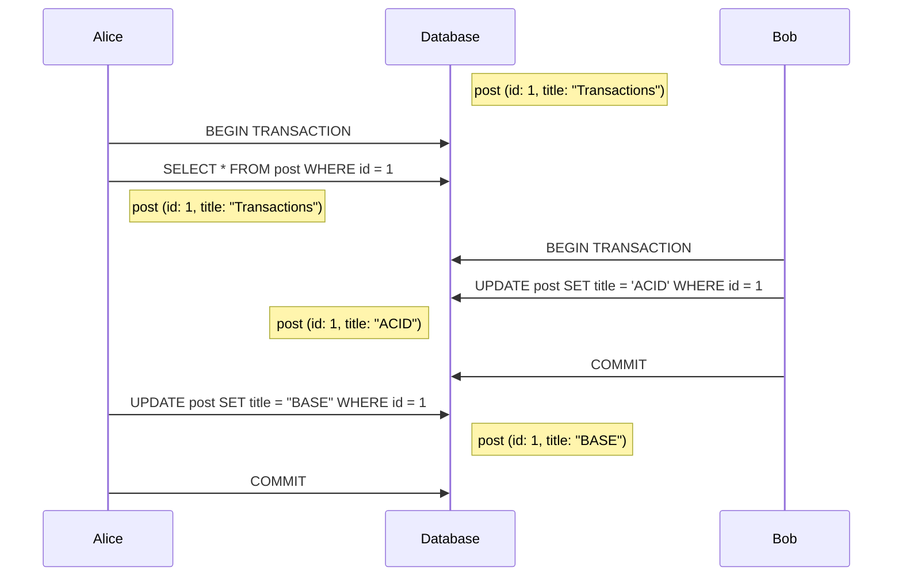

# Lost update
Happens when one transaction reads one row before another concurrent one modifies it, then the first transaction might make a business decision based on the read value which is no longer the real value. This one might be specially dangerous since it affects [[read-committed]], the default [[isolation-levels|isolation level]] in many database systems.

### Example
A customer might buy a product without knowing that it has changed in price.

## Solutions
* [[2pl]]: Acquiring a lock can prevent the second transaction from updating the records
* [[mvcc]]: By checking the versions, the phenomenon can be detected at commit for the first transaction and then abort it
