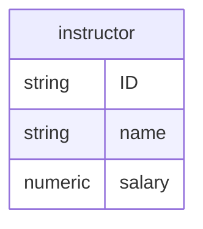

# Entity
Represents a real-world "thing" or "object" that is distinguishable from all others. These are grouped into *entity sets*

## Diagrammatic representation
A divided box, with a shaded top part that contains the name of the entity, and a larger one that contains the [[attribute]]s. The [[primary-key]] is underlined.

