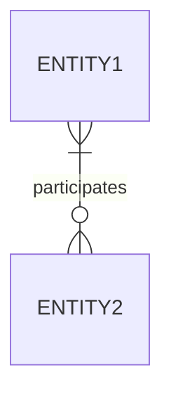

# Many-to-many
Both [[entity]]es [[participation|participating]] in a [[relationship]] can appear several times

## Diagrammatic representation
Standard [[participation]] notation applies

### [[diagram-standards|IDEF1X]]
Crow's feet are located on both sides of the line

### [[diagram-standards|Chen's notation]]
A diamond connects both entities with lines without arrow heads

