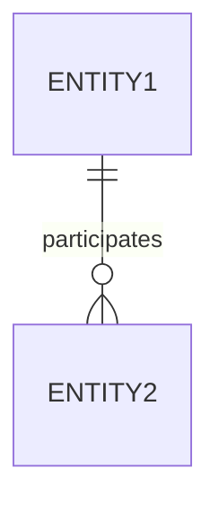

# One-to-many and Many-to-one
One of the [[participation|participating]] [[entity]]es appears at most once, and the other can appear many times.

## Diagrammatic representation
Standard [[participation]] notation applies.

### [[diagram-standards|IDEFIX]]
These are connected by lines, the side of the "one" has no decoration, while the side of the "many" has a "crow foot":

### [[diagram-standards|Chen's notation]]
A diamond represents the relation, with an arrow pointing to the "one" side and a line connected to the "many" side
