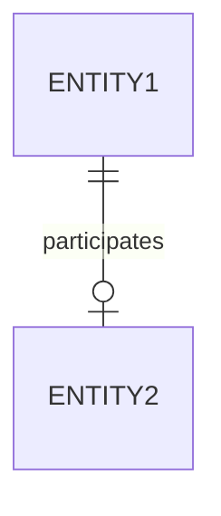

# One-to-one
A binary [[relationship]] where each [[entity]] might [[participation|participate]] at most once in it.

## Diagrammatic representation

### [[diagram-standards|IDEF1X]]
These are connected by lines with a vertical line at the end. A circle represents [[participation|partial participation]] while no circle represents [[participation|total participation]]

### [[diagram-standards|Chen's notation]]
These are represented by a diamond that points a directed line to each participating entity.
