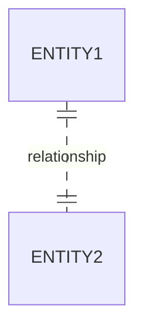

# Weak Entity
An [[entity]] whose identity depends on another entity. It doesn't have the necessary [[attribute]]s to uniquely identify itself, so it borrows them from an entity that does.

## Concepts
* The attributes of the weak entity are called **discriminator attributes**.
* **Identifying entity** it's the entity on which the weak entity depends.
* **Identifying [[relationship]]** is the relationship the weak entity has with its identifying entity

## Diagrammatic representation

### [[diagram-standards|IDEF1X]]
The weak entity is identified by a dotted line to its identifying entity

### [[diagram-standards|Chen's notation]]
The weak entity is identified by a double rectangle, and the diamond of the identifying relationship is also doubled.
