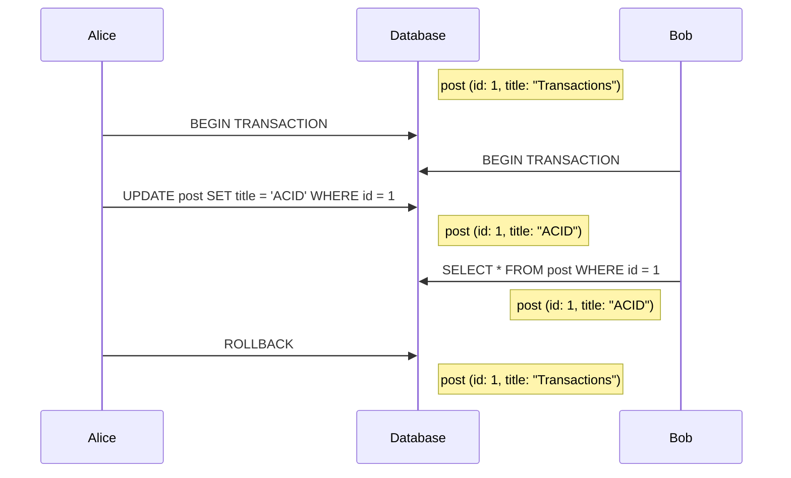

# Dirty read
Happens when one transaction reads uncommited changes from another transaction. This is risky because that other transaction might be rolled back.

## Solutions
* [[2pl]]: The uncommited rows are protected by write locks which prevent other concurrent transactions from reading these until they are committed.
* [[mvvc]]: The previous version of the uncommited change can be read instead of it.
