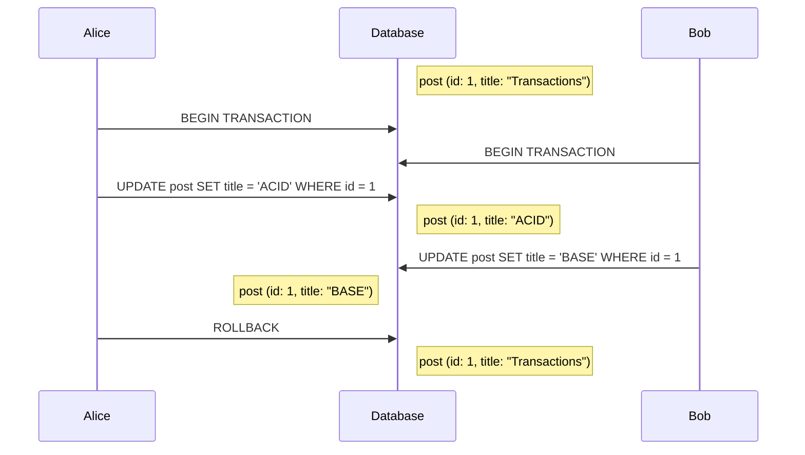

# Dirty write
Happens when two concurrent transactions modify the same row at the same time:

If I understood well, if both transactions commit, then it's just a [[lost-update]]. The biggest issue comes when one of the transacions rolls back, then, there are two action paths:

* It can restore its row to the previous version, but then overwrites the other transaction's uncommitted change.
* It can acknowledge the existence of a newer version (issued by the second transaction), but then, if the second transaction rolls back, its previous version is the uncommitted change of the first transaction.

Therefore, if the database engine did not prevent **dirty writes**, guaranteeing rollbacks would not be possible. Since [[atomicity]] cannot be implemented without rollbacks, all database systems at all [[isolation-levels]] prevent dirty writes.
