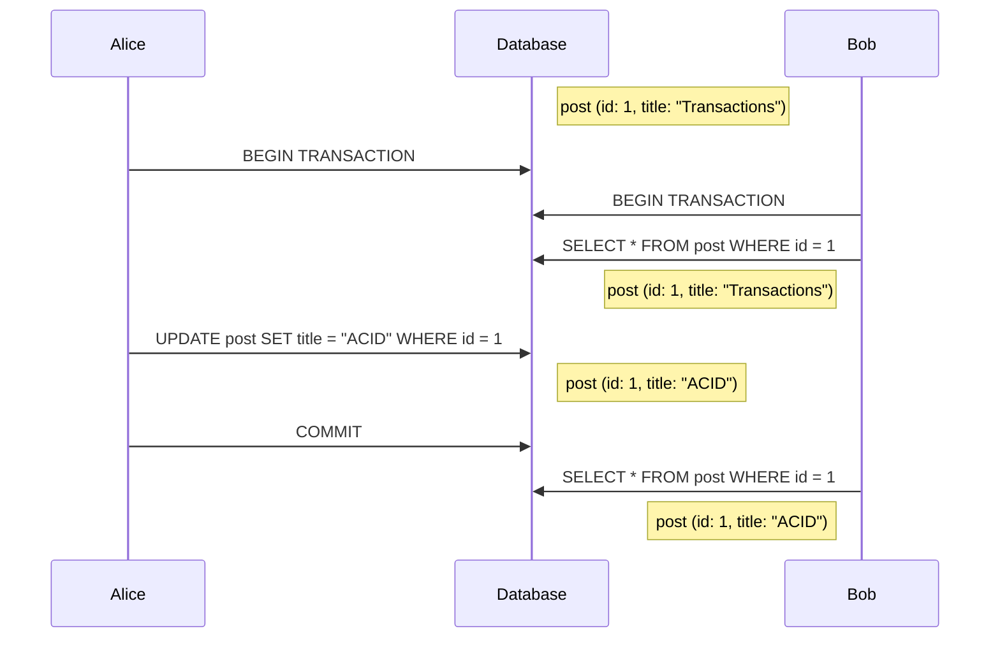

# Non-repeatable read
When a transaction reads a row and another concurrent transaction updates it before the first one is finished, so the first one can have two different values for the same row at different times during the transaction.

Some ORM frameworks offer application-level repeatable reads by caching the read entity.

## Solutions
* [[2pl]]: A lock can be obtained on the read resources to prevent these from being modified by another transaction
* [[mvvc]]: The version of the resources can be checked, the transaction can be aborted if the version has changed in the meantime.
