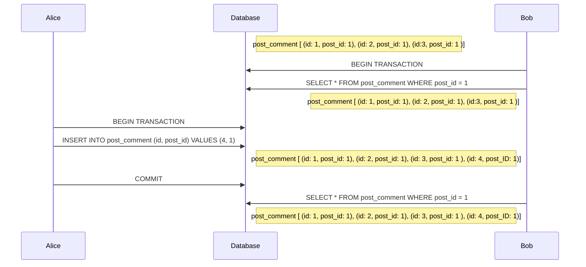

# Phantom read
When a transaction makes a business decission based on a set of rows satisfying a given predicate, and a concurrent transaction inserts a record matching that predicate in the meanwhile.

