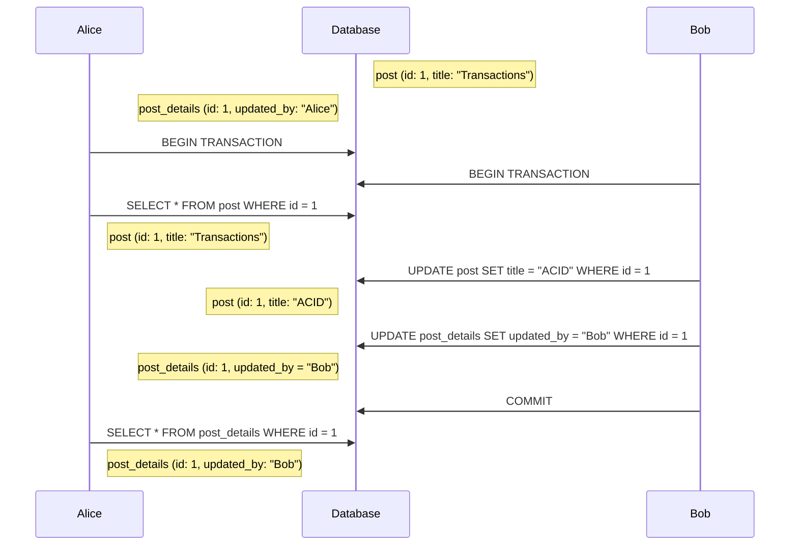

# Read skew
Occurs when there are integrity constaints between two or more tables. While one transaction retrieves rows from these tables separately, another concurrent transaction might update them. Therefore the first transaction might have rows from one table before the update and some rows after it.

In the sequence diagram, Alice believes that the post was updated by Bob, but this actually refers to a later version of the post.
