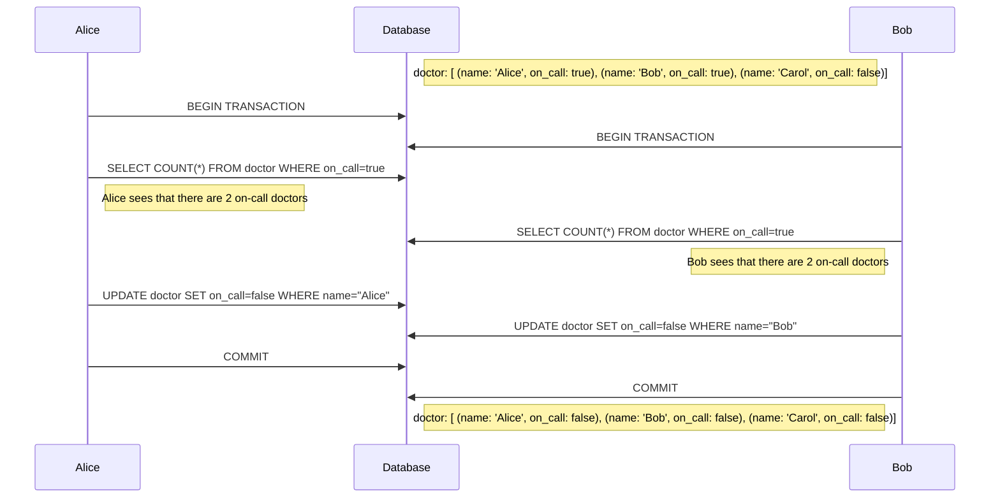

# Write skew
Where two concurrent transactions update disjoint data in a way that no separate transaction breaks an integrity constraint, but both together do.

==TODO: [[high-performance-java-persistence]] mentions that this phenomenon happens when updating two different tables, but this isn't actually a requisite, is it? What's the source on this term? How can I find it?==

### Example
Suppose an application for an hospital where there must always be at least one doctor on call at all times.

## Solutions
* [[2pl]]: The first transaction can acquire locks on these records
* [[mvcc]]: The constraints can be validated at commit for the first transaction, and then abort it.
